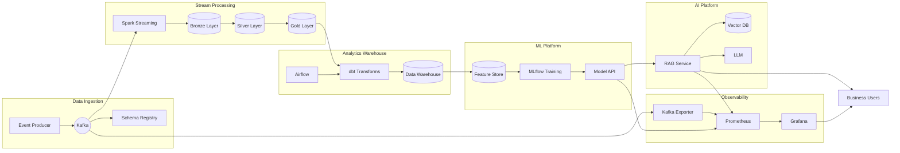

# Platform Architecture

## Data Flow

1. **Events** are produced to Kafka with schema validation
2. **Spark Streaming** processes events into Bronze/Silver/Gold layers
3. **dbt** transforms data for analytics in the warehouse
4. **MLflow** trains models on feature data
5. **FastAPI** serves models with A/B testing
6. **RAG service** explains predictions using vector search
7. **Prometheus + Grafana** monitor the entire platform
