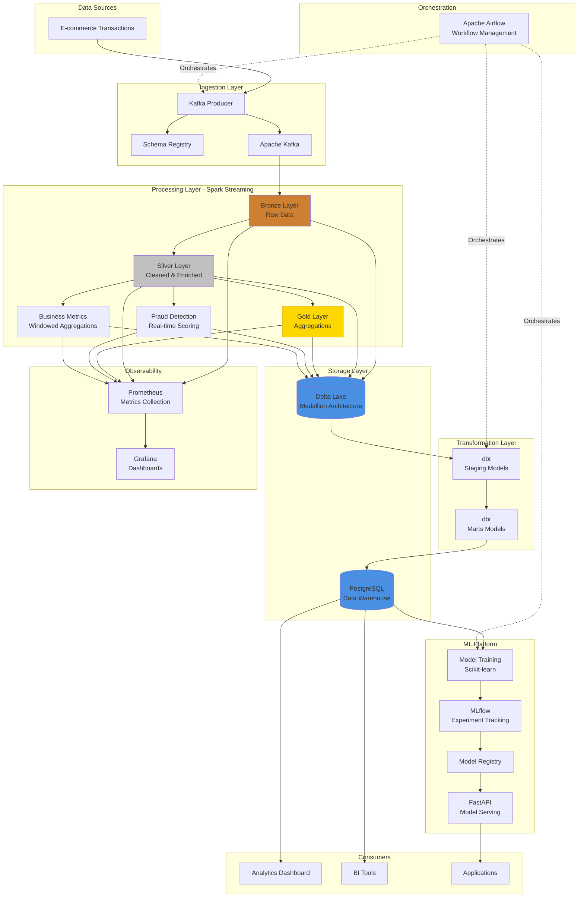

# Data Platform Architecture

## System Overview

This data platform implements a modern, real-time analytics architecture with ML capabilities.

## Architecture Diagram



## Data Flow

### 1. Ingestion Pipeline
```
E-commerce Transactions
    ↓
Kafka Producer (seed_events.py)
    ↓
Schema Registry (Avro Schema)
    ↓
Kafka Topic (ecommerce.transactions)
```

**Technology**: Apache Kafka, Schema Registry
**Frequency**: Continuous
**Volume**: Configurable (default 1000 transactions/hour)

### 2. Streaming Processing Pipeline

#### Bronze Layer (Raw Ingestion)
```
Kafka → Spark Structured Streaming → Delta Lake (Bronze)
```
- **Purpose**: Raw data preservation
- **Transformations**: Minimal (add metadata)
- **Format**: Parquet with Delta Lake transaction log
- **Partitioning**: By processing date

#### Silver Layer (Cleaned & Enriched)
```
Delta Bronze → Spark Transformations → Delta Lake (Silver)
```
- **Purpose**: Clean, validated, business-ready data
- **Transformations**:
  - Data quality checks (nulls, negatives)
  - Type conversions
  - Location parsing (city, country)
  - Amount categorization
  - Temporal features (hour, day of week, weekend flag)
- **Partitioning**: By transaction date

#### Gold Layer (Aggregated Metrics)
```
Delta Silver → Spark Aggregations → Delta Lake (Gold)
```
- **Purpose**: Business-level aggregations
- **Window**: 10-minute tumbling windows
- **Metrics**:
  - Transaction counts
  - Revenue totals
  - Average transaction values
  - Fraud rates
  - User/device counts
- **Grouping**: Merchant, payment method, country

### 3. Real-time Fraud Detection
```
Delta Silver → Fraud Scoring → Delta Lake (Fraud Detection)
```

**Scoring Factors**:
- Known fraud flag: +50 points
- High amount (>$5000): +30 points
- Crypto payment: +20 points
- High-risk country: +15 points
- Late night (11 PM - 5 AM): +10 points
- Weekend: +5 points
- Velocity (>5 tx in 30 min): +25 points

**Risk Classification**:
- CRITICAL: Score ≥ 75
- HIGH: Score ≥ 50
- MEDIUM: Score ≥ 25
- LOW: Score ≥ 10
- MINIMAL: Score < 10

### 4. Business Aggregations

#### Merchant Aggregations (15-min sliding, 5-min updates)
- Transaction volume & revenue
- Fraud rate by merchant
- Customer & device counts
- Payment method distribution

#### User Aggregations (1-hour tumbling)
- User spending patterns
- Merchant diversity
- Payment method usage
- Suspicious behavior detection

#### Country Aggregations (30-min tumbling)
- Geographic transaction volume
- Regional fraud rates
- Active users and merchants by location

#### Hourly Platform Summary
- Overall platform statistics
- Payment method distribution
- Platform-wide fraud rates
- High-value transaction rates

### 5. Data Warehouse Pipeline
```
Delta Lake → dbt Staging → dbt Marts → PostgreSQL
```

**dbt Models**:
- **Staging**: `stg_transactions.sql` - Clean, typed data
- **Marts**: `fct_transactions.sql` - Fact table for analytics

**Schedule**: Every 6 hours (via Airflow)

### 6. ML Pipeline
```
Delta Lake → Feature Extraction → Model Training → MLflow → Model Registry
```

**Training Pipeline**:
1. Extract features from Delta Lake
2. Train 3 models:
   - Logistic Regression (baseline)
   - Random Forest (ensemble)
   - Gradient Boosting (advanced)
3. Evaluate with cross-validation
4. Log to MLflow
5. Register best model (F1 score)

**Deployment Criteria**:
- Precision ≥ 80%
- Recall ≥ 70%
- F1 Score ≥ 75%

**Schedule**: Weekly (Sundays via Airflow)

### 7. Model Serving
```
Model Registry → FastAPI → REST API
```

**Endpoints**:
- `POST /predict` - Single transaction prediction
- `POST /predict/batch` - Batch predictions
- `GET /health` - Service health check

**A/B Testing**: Canary deployment support

## Technology Stack

### Data Ingestion
- **Apache Kafka 7.6.1**: Message streaming platform
- **Schema Registry 7.6.1**: Schema management
- **Zookeeper 7.6.1**: Kafka coordination

### Data Processing
- **Apache Spark 3.5.0**: Unified analytics engine
- **Delta Lake 3.0.0**: ACID transactions for data lakes
- **Spark Structured Streaming**: Real-time stream processing

### Data Transformation
- **dbt 1.9.0**: SQL-based transformations
- **PostgreSQL 15**: Data warehouse

### ML Platform
- **Scikit-learn 1.4.0**: Machine learning
- **MLflow 2.10.0**: Experiment tracking & model registry
- **FastAPI 0.115.6**: Model serving API

### Orchestration
- **Apache Airflow 2.8.0**: Workflow orchestration
- **Redis**: Celery backend

### Observability
- **Prometheus 2.45.0**: Metrics collection
- **Grafana 10.0.0**: Visualization & dashboards

### Infrastructure
- **Docker Compose**: Container orchestration
- **Python 3.13**: Programming language

## Deployment Architecture

### Docker Services
```yaml
Services:
  - kafka: 9092
  - zookeeper: 2181
  - schema-registry: 8081
  - postgres: 5433
  - airflow-webserver: 8082
  - mlflow: 5002
  - prometheus: 9095
  - grafana: 3002
  - kafka-exporter: 9308
```

### Network Architecture
```
┌─────────────────────────────────────────────────┐
│               Docker Network                    │
│                                                 │
│  ┌──────────┐  ┌──────────┐  ┌──────────┐     │
│  │  Kafka   │  │Postgres  │  │  MLflow  │     │
│  │  :9092   │  │  :5433   │  │  :5002   │     │
│  └──────────┘  └──────────┘  └──────────┘     │
│                                                 │
│  ┌──────────┐  ┌──────────┐  ┌──────────┐     │
│  │ Airflow  │  │Prometheus│  │ Grafana  │     │
│  │  :8082   │  │  :9095   │  │  :3002   │     │
│  └──────────┘  └──────────┘  └──────────┘     │
│                                                 │
└─────────────────────────────────────────────────┘
                      ↓
            ┌──────────────────┐
            │   Host Machine   │
            │  localhost:*     │
            └──────────────────┘
```

## Data Models

### Transaction Schema (Avro)
```json
{
  "type": "record",
  "name": "Transaction",
  "fields": [
    {"name": "transaction_id", "type": "string"},
    {"name": "user_id", "type": "int"},
    {"name": "amount", "type": "double"},
    {"name": "merchant", "type": "string"},
    {"name": "timestamp", "type": "string"},
    {"name": "is_fraud", "type": "boolean"},
    {"name": "payment_method", "type": "string"},
    {"name": "location", "type": "string"},
    {"name": "device_id", "type": "string"}
  ]
}
```

### Delta Lake Schema Evolution

**Bronze**:
- Raw transaction fields
- Kafka metadata (offset, partition, timestamp)
- Processing metadata

**Silver**:
- All Bronze fields
- Parsed timestamp
- Extracted location (city, country)
- Categorized amount
- Temporal features (hour, day_of_week, is_weekend)
- High-value flag

**Gold**:
- Aggregated metrics
- Window timestamps
- Calculated KPIs

## Performance Characteristics

### Throughput
- **Kafka**: 10,000+ messages/sec
- **Spark Streaming**: Micro-batches every 5 seconds
- **Delta Lake**: ACID transactions with snapshot isolation

### Latency
- **End-to-end (Kafka → Gold)**: ~15 seconds
- **Fraud Detection**: Real-time (< 1 second)
- **ML Inference**: < 100ms per prediction

### Scalability
- **Horizontal**: Add Kafka partitions, Spark executors
- **Vertical**: Increase executor memory, cores
- **Storage**: Delta Lake handles petabyte-scale data

## Monitoring & Alerting

### Metrics Collected
- Kafka throughput & lag
- Spark batch duration & processing rate
- Delta Lake table sizes
- ML model performance (precision, recall, F1)
- API latency & error rates

### Dashboards
1. **Platform Overview**: System health
2. **Data Pipeline**: Ingestion to warehouse
3. **ML Metrics**: Model performance over time
4. **Business KPIs**: Transaction metrics

## Security

### Data Protection
- **At Rest**: Delta Lake encryption
- **In Transit**: TLS for all services
- **Access Control**: RLS in PostgreSQL

### Authentication
- Airflow: Password-based
- MLflow: Token-based (production)
- Grafana: OAuth (production)

### Secrets Management
- Environment variables for local dev
- Vault/Secret Manager for production

## Future Enhancements

- [ ] Stream processing with Apache Flink
- [ ] Real-time OLAP with Apache Druid
- [ ] Feature store with Feast
- [ ] Data quality with Great Expectations
- [ ] CDC with Debezium
- [ ] Kubernetes deployment
- [ ] CI/CD with GitHub Actions
- [ ] Cost optimization with spot instances
